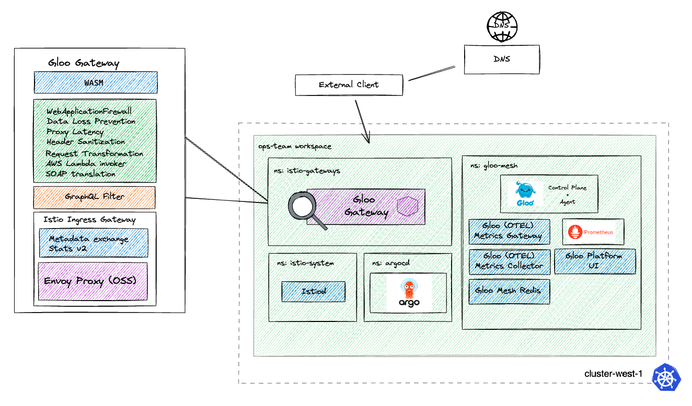
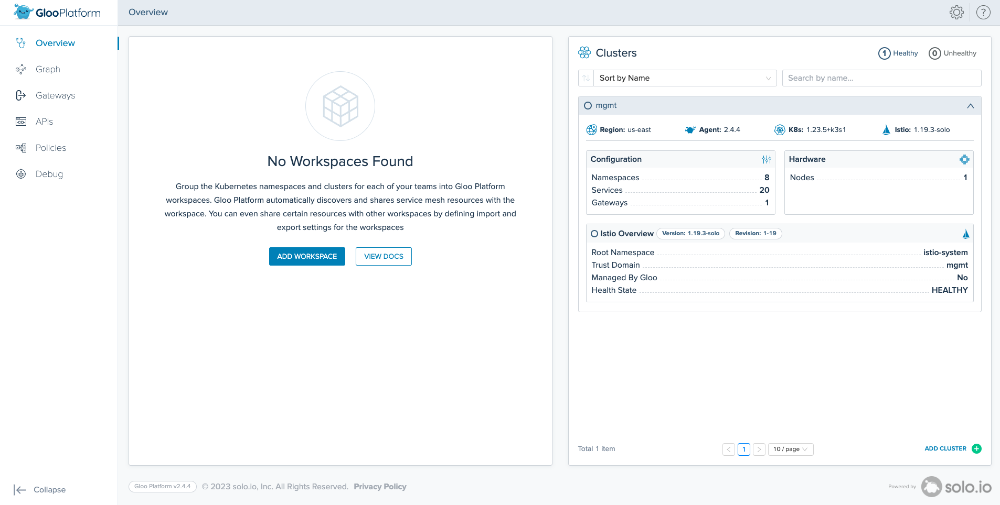

# Deploy a Single Cluster Gloo Mesh with Argo CD

## Introduction
GitOps is becoming increasingly popular approach to manage Kubernetes components. It works by using Git as a single source of truth for declarative infrastructure and applications, allowing your application definitions, configurations, and environments to be declarative and version controlled. This helps to make these workflows automated, auditable, and easy to understand.

## Purpose of this Tutorial
The main goal of this tutorial is to showcase how Gloo Mesh components can seamlessly integrate into a GitOps workflow, with Argo CD being our tool of choice. We'll guide you through the installation of Argo CD, Gloo Platform, Istio, and finally, we'll explore the Gloo Mesh Dashboard.

## High Level Architecture


## Prerequisites
This tutorial assumes a single Kubernetes cluster for demonstration. Instructions have been validated on k3d, as well as in EKS and GKE. Please note that the setup and installation of Kubernetes are beyond the scope of this guide. Ensure that your cluster contexts are named `gloo` by running:
```
% kubectl config get-contexts
CURRENT   NAME   CLUSTER    AUTHINFO         NAMESPACE
*         gloo   k3d-gloo   admin@k3d-gloo   
```

#### Renaming Cluster Context
If your local clusters have a different context name, you will want to have it match the expected context name(s)
```
kubectl config rename-context <k3d-your_cluster_name> gloo
```

### Installing Argo CD	
Let's start by deploying Argo CD to our `gloo` cluster context

Create Argo CD namespace
```
kubectl create namespace argocd --context gloo
```

Deploy Argo CD 2.8.0 using the [non-HA YAML manifests](https://github.com/argoproj/argo-cd/releases)
```
until kubectl apply -k https://github.com/solo-io/gitops-library.git/argocd/deploy/default/ --context gloo > /dev/null 2>&1; do sleep 2; done
```

Check to see Argo CD status
```
kubectl get pods -n argocd --context gloo
```

Output should look similar to below
```
% kubectl get pods -n argocd --context gloo
NAME                                  READY   STATUS    RESTARTS   AGE
argocd-redis-74d8c6db65-lj5qz         1/1     Running   0          5m48s
argocd-dex-server-5896d988bb-ksk5j    1/1     Running   0          5m48s
argocd-application-controller-0       1/1     Running   0          5m48s
argocd-repo-server-6fd99dbbb5-xr8ld   1/1     Running   0          5m48s
argocd-server-7dd7894bd7-t92rr        1/1     Running   0          5m48s
```

We can also change the password to: `admin / solo.io`:
```
# bcrypt(password)=$2a$10$79yaoOg9dL5MO8pn8hGqtO4xQDejSEVNWAGQR268JHLdrCw6UCYmy
# password: solo.io
kubectl --context gloo -n argocd patch secret argocd-secret \
  -p '{"stringData": {
    "admin.password": "$2a$10$79yaoOg9dL5MO8pn8hGqtO4xQDejSEVNWAGQR268JHLdrCw6UCYmy",
    "admin.passwordMtime": "'$(date +%FT%T%Z)'"
  }}'
```

#### Navigating to Argo CD UI
At this point, we should be able to access our Argo CD server using port-forward at http://localhost:9999
```
kubectl port-forward svc/argocd-server -n argocd 9999:443 --context gloo
```

## Provide Gloo Mesh Enterprise License Key variable
Gloo Mesh Enterprise requires a Trial License Key:
```
GLOO_MESH_LICENSE_KEY=<input_license_key_here>
```

## Installing Gloo Mesh
Gloo Mesh can be installed and configured easily using Helm + Argo CD. To install Gloo Mesh Enterprise 2.4.4 

First we will deploy the Gloo Platform CRD helm chart using an Argo Application
```
kubectl apply --context gloo -f- <<EOF
apiVersion: argoproj.io/v1alpha1
kind: Application
metadata:
  name: gloo-platform-crds
  namespace: argocd
spec:
  destination:
    namespace: gloo-mesh
    server: https://kubernetes.default.svc
  project: default
  source:
    chart: gloo-platform-crds
    repoURL: https://storage.googleapis.com/gloo-platform/helm-charts
    targetRevision: 2.4.4
  syncPolicy:
    automated:
      prune: true
      selfHeal: true
    syncOptions:
    - CreateNamespace=true 
    retry:
      limit: 2
      backoff:
        duration: 5s
        maxDuration: 3m0s
        factor: 2
EOF
```

Then deploy the Gloo Platform helm chart
```
kubectl apply --context gloo -f- <<EOF
apiVersion: argoproj.io/v1alpha1
kind: Application
metadata:
  name: gloo-platform-helm
  namespace: argocd
  finalizers:
  - resources-finalizer.argocd.argoproj.io
spec:
  destination:
    server: https://kubernetes.default.svc
    namespace: gloo-mesh
  project: default
  source:
    chart: gloo-platform
    helm:
      skipCrds: true
      values: |
        licensing:
          licenseKey: ${GLOO_MESH_LICENSE_KEY}
        common:
          cluster: gloo
        glooMgmtServer:
          enabled: true
          serviceType: LoadBalancer
          registerCluster: true
          createGlobalWorkspace: true
          ports:
            healthcheck: 8091
        prometheus:
          enabled: true
        redis:
          deployment:
            enabled: true
        telemetryGateway:
          enabled: true
          service:
            type: LoadBalancer
        telemetryCollector:
          enabled: true
          config:
            exporters:
              otlp:
                endpoint: gloo-telemetry-gateway.gloo-mesh:4317
        glooUi:
          enabled: true
          serviceType: ClusterIP
        glooAgent:
          enabled: true
          relay:
            serverAddress: gloo-mesh-mgmt-server:9900
    repoURL: https://storage.googleapis.com/gloo-platform/helm-charts
    targetRevision: 2.4.4
  syncPolicy:
    automated:
      prune: true
      selfHeal: true
    syncOptions:
      - CreateNamespace=true
  # ignore the self-signed certs that are being generated automatically    
  ignoreDifferences:
  - group: v1
    kind: Secret    
EOF
```

You can check to see that the Gloo Mesh Management Plane is deployed
```
kubectl get pods -n gloo-mesh --context gloo
```

Output should look similar to below:
```
% kubectl get pods -n gloo-mesh --context gloo 
NAME                                     READY   STATUS    RESTARTS   AGE
gloo-mesh-redis-788545948f-r2lp6         1/1     Running   0          10m
gloo-telemetry-gateway-677b9b65f-nnl7z   1/1     Running   0          10m
gloo-mesh-mgmt-server-5ddc5f8b6b-rpkwz   1/1     Running   0          10m
gloo-mesh-ui-6879b5c9cc-ffbzk            3/3     Running   0          10m
prometheus-server-6d8c8bc5b9-sjszn       2/2     Running   0          10m
gloo-mesh-agent-5c549ccb4b-lxjdp         1/1     Running   0          10m
```

## Installing Istio
Here we will use Argo CD to demonstrate how to deploy and manage Istio using helm.

First deploy the Istio base 1.19.3 helm chart to `gloo`
```
kubectl apply --context gloo -f- <<EOF
apiVersion: argoproj.io/v1alpha1
kind: Application
metadata:
  name: istio-base
  namespace: argocd
  finalizers:
  - resources-finalizer.argocd.argoproj.io
  annotations:
    argocd.argoproj.io/sync-wave: "-3"
spec:
  destination:
    server: https://kubernetes.default.svc
    namespace: istio-system
  project: default
  source:
    chart: base
    repoURL: https://istio-release.storage.googleapis.com/charts
    targetRevision: 1.19.3
  syncPolicy:
    automated:
      prune: true
      selfHeal: true
    syncOptions:
    - CreateNamespace=true
EOF
```

Now, lets deploy the Istio control plane:
```
kubectl apply --context gloo -f- <<EOF
apiVersion: argoproj.io/v1alpha1
kind: Application
metadata:
  name: istiod
  namespace: argocd
  finalizers:
  - resources-finalizer.argocd.argoproj.io
spec:
  destination:
    server: https://kubernetes.default.svc
    namespace: istio-system
  project: default
  source:
    chart: istiod
    repoURL: https://istio-release.storage.googleapis.com/charts
    targetRevision: 1.19.3
    helm:
      values: |
        revision: 1-19
        global:
          meshID: mesh1
          multiCluster:
            clusterName: gloo
          network: network1
          hub: us-docker.pkg.dev/gloo-mesh/istio-workshops
          tag: 1.19.3-solo
        meshConfig:
          trustDomain: gloo
          accessLogFile: /dev/stdout
          accessLogEncoding: JSON
          enableAutoMtls: true
          defaultConfig:
            # Wait for the istio-proxy to start before starting application pods
            holdApplicationUntilProxyStarts: true
            envoyAccessLogService:
              address: gloo-mesh-agent.gloo-mesh:9977
            proxyMetadata:
              ISTIO_META_DNS_CAPTURE: "true"
              ISTIO_META_DNS_AUTO_ALLOCATE: "true"
          outboundTrafficPolicy:
            mode: ALLOW_ANY
          rootNamespace: istio-system
        pilot:
          env:
            PILOT_ENABLE_K8S_SELECT_WORKLOAD_ENTRIES: "false"
            PILOT_SKIP_VALIDATE_TRUST_DOMAIN: "true"
  syncPolicy:
    automated:
      prune: true
      selfHeal: true
    #automated: {}
  ignoreDifferences:
  - group: '*'
    kind: '*'
    managedFieldsManagers:
    - argocd-application-controller
EOF
```

Now we can deploy the Istio Ingressgateway
```
kubectl apply --context gloo -f- <<EOF
apiVersion: argoproj.io/v1alpha1
kind: Application
metadata:
  name: istio-ingressgateway
  namespace: argocd
  finalizers:
  - resources-finalizer.argocd.argoproj.io
  annotations:
    argocd.argoproj.io/sync-wave: "-1"
spec:
  destination:
    server: https://kubernetes.default.svc
    namespace: istio-gateways
  project: default
  source:
    chart: gateway
    repoURL: https://istio-release.storage.googleapis.com/charts
    targetRevision: 1.19.3
    helm:
      values: |
        # Name allows overriding the release name. Generally this should not be set
        name: "istio-ingressgateway-1-19"
        # revision declares which revision this gateway is a part of
        revision: "1-19"
        
        replicaCount: 1
        
        service:
          # Type of service. Set to "None" to disable the service entirely
          type: LoadBalancer
          ports:
          - name: http2
            port: 80
            protocol: TCP
            targetPort: 80
          - name: https
            port: 443
            protocol: TCP
            targetPort: 443
          annotations:
            # AWS NLB Annotation
            service.beta.kubernetes.io/aws-load-balancer-type: "nlb"
          loadBalancerIP: ""
          loadBalancerSourceRanges: []
          externalTrafficPolicy: ""
        
        # Pod environment variables
        env: {}

        annotations:
          proxy.istio.io/config: '{ "holdApplicationUntilProxyStarts": true }'
        
        # Labels to apply to all resources
        labels:
          istio.io/rev: 1-19
          istio: ingressgateway
  syncPolicy:
    automated:
      prune: true
      selfHeal: true
    syncOptions:
    - CreateNamespace=true
EOF
```

You can check to see that istiod and the istio ingressgateways have been deployed
```
kubectl get pods -n istio-system --context gloo && kubectl get pods -n istio-gateways --context gloo
```

Output should look similar to below:
```
% kubectl get pods -n istio-system --context gloo && kubectl get pods -n istio-gateways --context gloo
NAME                          READY   STATUS    RESTARTS   AGE
istiod-1-19-b6ff5fbf7-92bx9   1/1     Running   0          60s
NAME                                         READY   STATUS    RESTARTS   AGE
istio-ingressgateway-1-19-844fc985cd-hfbm5   1/1     Running   0          45s
```

### Visualize in Gloo Mesh Dashboard
Access Gloo Mesh Dashboard at `http://localhost:8090`:
```
kubectl port-forward -n gloo-mesh svc/gloo-mesh-ui 8090 --context gloo
```

At this point, you should have ArgoCD, Gloo Mesh, and Istio installed on the cluster!


## Cleanup
To uninstall, you can delete the Argo Applications
```
kubectl delete applications -n argocd istio-ingressgateway
kubectl delete applications -n argocd istiod
kubectl delete applications -n argocd istio-base
kubectl delete applications -n argocd gloo-platform-helm
kubectl delete applications -n argocd gloo-platform-crds
```

## Lets have some fun
To streamline deployment, utilize the Argo app-of-apps pattern to manage and orchestrate the entire setup in one `Application`!

To avoid storing the license key in Git, we can enhance security by utilizing a licenseSecretKeyRef in the Helm values, necessitating the creation of the license key as a secret.

## Provide Gloo Mesh Enterprise License Key variable
In case you havent configured it already, Gloo Mesh Enterprise requires a Trial License Key:
```
GLOO_MESH_LICENSE_KEY=<input_license_key_here>
```

The license is stored as a base64 encoded secret, set your the following variable based on your OS:

For Linux:
```
# Linux
    BASE64_LICENSE_KEY=$(echo -n "${GLOO_MESH_LICENSE_KEY}" | base64 -w 0)
```

For Mac:
```
# Mac OSX
    BASE64_LICENSE_KEY=$(echo -n "${GLOO_MESH_LICENSE_KEY}" | base64 | tr -d '[:space:]')
```

Create the license secret:
```
# Create namespace for Gloo Mesh
kubectl create ns gloo-mesh --context gloo

# Apply license keys as a Kubernetes secret
kubectl apply --context gloo -f - <<EOF
apiVersion: v1
data:
  gloo-gateway-license-key: ${BASE64_LICENSE_KEY}
  gloo-mesh-license-key: ${BASE64_LICENSE_KEY}
  gloo-network-license-key: ${BASE64_LICENSE_KEY}
  gloo-trial-license-key: ${BASE64_LICENSE_KEY}
kind: Secret
metadata:
  name: gloo-license
  namespace: gloo-mesh
type: Opaque
EOF
```

Now we can deploy an Argo app-of-app which will configure the entire setup that we walked through in the previous section
```
kubectl apply --context gloo -f - <<EOF
apiVersion: argoproj.io/v1alpha1
kind: Application
metadata:
  name: easybutton
  namespace: argocd
  finalizers:
  - resources-finalizer.argocd.argoproj.io
spec:
  project: default
  source:
    repoURL: https://github.com/ably77/gloo-mesh-singlecluster-argocd/
    path: easybutton/app-of-app
    targetRevision: HEAD
    directory:
      recurse: true
  destination:
    server: https://kubernetes.default.svc
  syncPolicy:
    automated:
      prune: true
      selfHeal: true
    retry:
      limit: 5
      backoff:
        duration: 5s
        factor: 2
        maxDuration: 3m0s
EOF
```

You can check to see that Gloo Mesh, Istiod and the Istio ingressgateways have been deployed
```
kubectl get pods -n gloo-mesh --context gloo && \
kubectl get pods -n istio-system --context gloo && \
kubectl get pods -n istio-gateways --context gloo
```

### Visualize in Gloo Mesh Dashboard
Access Gloo Mesh Dashboard at `http://localhost:8090`:
```
kubectl port-forward -n gloo-mesh svc/gloo-mesh-ui 8090 --context gloo