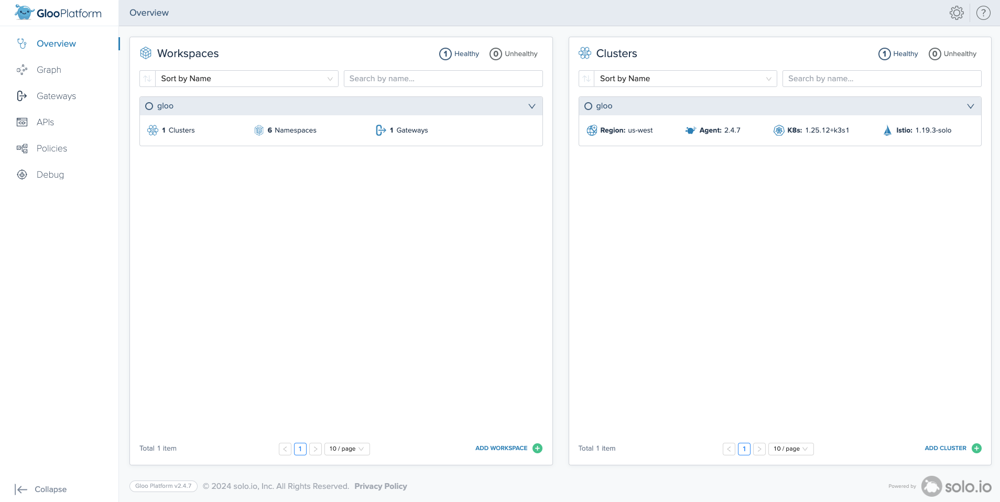

# Deploy a Single Cluster Gloo Mesh with Argo CD

## Introduction
GitOps is becoming increasingly popular approach to manage Kubernetes components. It works by using Git as a single source of truth for declarative infrastructure and applications, allowing your application definitions, configurations, and environments to be declarative and version controlled. This helps to make these workflows automated, auditable, and easy to understand.

## Purpose of this Tutorial
The main goal of this tutorial is to showcase how Gloo Mesh components can seamlessly integrate into a GitOps workflow, with Argo CD being our tool of choice. We'll guide you through the installation of Argo CD, Gloo Platform, Istio, and we'll explore the Gloo Mesh Dashboard. 

Beyond the installation walkthroughs, we'll engage in practical exercises specifically designed to showcase the robustness of the system. These exercises serve as a technical demonstration of how the pull/sync mechanism offered by Argo CD enhances the reliability and resilience of your service mesh deployment. 

## High Level Architecture


## Prerequisites
This tutorial assumes a single Kubernetes cluster for demonstration. Instructions have been validated on k3d, as well as in EKS and GKE. Please note that the setup and installation of Kubernetes are beyond the scope of this guide. Ensure that your cluster contexts are named `gloo` by running:
```bash
kubectl config get-contexts
```
```
CURRENT   NAME   CLUSTER    AUTHINFO         NAMESPACE
*         gloo   k3d-gloo   admin@k3d-gloo   
```

## Set Environment variables

To get started, set the `MY_CLUSTER_CONTEXT` and `MY_CLUSTER_NAME` vars for our cluster

```bash
export MY_CLUSTER_CONTEXT=gloo
export MY_CLUSTER_NAME=gloo
```

#### Renaming Cluster Context
If your local clusters have a different context name, you will want to have it match the expected context name(s). In this example, we are setting the context name as `gloo`.

```bash
kubectl config rename-context <k3d-your_cluster_name> "${MY_CLUSTER_CONTEXT}"
```

Gloo Mesh Enterprise requires a Trial License Key:

```bash
GLOO_MESH_LICENSE_KEY=<input_license_key_here>
```

To deploy Istio, set the the Istio hub, version, and revision label

```bash
export HUB=us-docker.pkg.dev/gloo-mesh/istio-workshops
export ISTIO_VERSION=1.19.3-solo
export ISTIO_REVISION=1-19
```

Reminder if you want a specific version of Istio or to use the officially supported images provided by Solo.io, get the Hub value from the [Solo support page for Istio Solo images](https://support.solo.io/hc/en-us/articles/4414409064596). The value is present within the `Solo.io Istio Versioning Repo key` section

Otherwise, we can use the `1.19.3-solo` Istio image provided in our Solo Workshops

Provide the Gloo Mesh version:

```bash
export GLOO_MESH_VERSION=2.5.0
```

### Installing Argo CD	
Let's start by deploying Argo CD to our `gloo` cluster context

Create Argo CD namespace
```bash
kubectl create namespace argocd --context "${MY_CLUSTER_CONTEXT}"
```

Deploy Argo CD 2.8.0 using the [non-HA YAML manifests](https://github.com/argoproj/argo-cd/releases)
<!-- Using https://github.com/solo-io/gitops-library/tree/main/argocd/deploy/default -->
```bash
until kubectl apply -k https://github.com/solo-io/gitops-library.git/argocd/deploy/default/ --context "${MY_CLUSTER_CONTEXT}" > /dev/null 2>&1; do sleep 2; done
```

Check deployment status:
```bash
kubectl --context ${MY_CLUSTER_CONTEXT} -n argocd rollout status deploy/argocd-applicationset-controller
kubectl --context ${MY_CLUSTER_CONTEXT} -n argocd rollout status deploy/argocd-dex-server
kubectl --context ${MY_CLUSTER_CONTEXT} -n argocd rollout status deploy/argocd-notifications-controller
kubectl --context ${MY_CLUSTER_CONTEXT} -n argocd rollout status deploy/argocd-redis
kubectl --context ${MY_CLUSTER_CONTEXT} -n argocd rollout status deploy/argocd-repo-server
kubectl --context ${MY_CLUSTER_CONTEXT} -n argocd rollout status deploy/argocd-server
```

Check to see Argo CD status.
```bash
kubectl get pods -n argocd --context "${MY_CLUSTER_CONTEXT}"
```

Output should look similar to below
```bash
NAME                                                READY   STATUS    RESTARTS   AGE
argocd-application-controller-0                     1/1     Running   0          31s
argocd-applicationset-controller-765944f45d-569kn   1/1     Running   0          33s
argocd-dex-server-7977459848-swnm6                  1/1     Running   0          33s
argocd-notifications-controller-6587c9d9-6t4hg      1/1     Running   0          32s
argocd-redis-b5d6bf5f5-52mk5                        1/1     Running   0          32s
argocd-repo-server-7bfc968f69-hrqt6                 1/1     Running   0          32s
argocd-server-77f84bfbb8-lgdlr                      2/2     Running   0          32s
```

We can also change the password to: `admin / solo.io`:
```bash
# bcrypt(password)=$2a$10$79yaoOg9dL5MO8pn8hGqtO4xQDejSEVNWAGQR268JHLdrCw6UCYmy
# password: solo.io
kubectl --context "${MY_CLUSTER_CONTEXT}" -n argocd patch secret argocd-secret \
  -p '{"stringData": {
    "admin.password": "$2a$10$79yaoOg9dL5MO8pn8hGqtO4xQDejSEVNWAGQR268JHLdrCw6UCYmy",
    "admin.passwordMtime": "'$(date +%FT%T%Z)'"
  }}'
```

#### Navigating to Argo CD UI
At this point, we should be able to access our Argo CD server using port-forward at http://localhost:9999
```
kubectl port-forward svc/argocd-server -n argocd 9999:443 --context "${MY_CLUSTER_CONTEXT}"
```

## Installing Gloo Mesh
Gloo Mesh can be installed and configured easily using Helm + Argo CD. To install Gloo Mesh Enterprise

First we will deploy the Gloo Platform CRD helm chart using an Argo Application
```bash
kubectl apply --context "${MY_CLUSTER_CONTEXT}" -f- <<EOF
apiVersion: argoproj.io/v1alpha1
kind: Application
metadata:
  name: gloo-platform-crds
  namespace: argocd
spec:
  destination:
    namespace: gloo-mesh
    server: https://kubernetes.default.svc
  project: default
  source:
    chart: gloo-platform-crds
    repoURL: https://storage.googleapis.com/gloo-platform/helm-charts
    targetRevision: "${GLOO_MESH_VERSION}"
    helm:
      values: |
        featureGates:
          ExternalWorkloads: true
        enabledExperimentalApi: "{externalworkloads.networking.gloo.solo.io/v2alpha1,spireregistrationentries.internal.gloo.solo.io/v2alpha1}"     
  syncPolicy:
    automated:
      prune: true
      selfHeal: true
    syncOptions:
    - CreateNamespace=true 
    retry:
      limit: 2
      backoff:
        duration: 5s
        maxDuration: 3m0s
        factor: 2
EOF
```

Then deploy the Gloo Platform helm chart
```bash
kubectl apply --context "${MY_CLUSTER_CONTEXT}" -f- <<EOF
apiVersion: argoproj.io/v1alpha1
kind: Application
metadata:
  name: gloo-platform-helm
  namespace: argocd
  finalizers:
  - resources-finalizer.argocd.argoproj.io
spec:
  destination:
    server: https://kubernetes.default.svc
    namespace: gloo-mesh
  project: default
  source:
    chart: gloo-platform
    helm:
      skipCrds: true
      values: |
        licensing:
          licenseKey: ${GLOO_MESH_LICENSE_KEY}
        common:
          cluster: "${MY_CLUSTER_NAME}"
        glooMgmtServer:
          enabled: true
          serviceType: LoadBalancer
          registerCluster: true
          createGlobalWorkspace: true
        prometheus:
          enabled: true
        redis:
          deployment:
            enabled: true
        telemetryGateway:
          enabled: true
          service:
            type: ClusterIP
        telemetryCollector:
          enabled: true
          config:
            exporters:
              otlp:
                endpoint: gloo-telemetry-gateway.gloo-mesh:4317
        glooUi:
          enabled: true
          serviceType: ClusterIP
        glooAgent:
          enabled: true
          relay:
            serverAddress: gloo-mesh-mgmt-server:9900
    repoURL: https://storage.googleapis.com/gloo-platform/helm-charts
    targetRevision: "${GLOO_MESH_VERSION}"
  syncPolicy:
    automated:
      prune: true
      selfHeal: true
    syncOptions:
      - CreateNamespace=true
  # commenting out, not sure if necessary
  # ignore the self-signed certs that are being generated automatically    
  #ignoreDifferences:
  #- group: v1
  #  kind: Secret    
EOF
```

You can check to see that the Gloo Mesh Management Plane is deployed
```bash
kubectl get pods -n gloo-mesh  --context "${MY_CLUSTER_CONTEXT}"
```

Output should look similar to below:
```bash
NAME                                      READY   STATUS    RESTARTS   AGE
gloo-mesh-agent-7b79dd5c9-hfw9p           1/1     Running   0          62s
gloo-mesh-mgmt-server-7f6968d9b9-67l7j    1/1     Running   0          62s
gloo-mesh-redis-84f57d46bc-dwqx9          1/1     Running   0          62s
gloo-mesh-ui-56879cb8b-52vpx              3/3     Running   0          61s
gloo-telemetry-collector-agent-7fgb5      1/1     Running   0          62s
gloo-telemetry-collector-agent-txwbm      1/1     Running   0          62s
gloo-telemetry-gateway-5445d7d6b5-5k9sd   1/1     Running   0          62s
prometheus-server-565cb79f89-jc5ns        2/2     Running   0          62s
```

### install `meshctl`
```bash
curl -sL https://run.solo.io/meshctl/install | GLOO_MESH_VERSION="v${GLOO_MESH_VERSION}" sh - ;
export PATH=$HOME/.gloo-mesh/bin:$PATH
```

You can check status using the `meshctl` CLI
```bash
meshctl check --kubecontext "${MY_CLUSTER_CONTEXT}"
```

Output should look similar to below:
```bash
🟢 License status

 INFO  gloo-mesh enterprise license expiration is 04 Jun 24 16:41 EDT
 INFO  No GraphQL license module found for any product

🟢 CRD version check


🟢 Gloo Platform deployment status

Namespace | Name                           | Ready | Status
gloo-mesh | gloo-mesh-agent                | 1/1   | Healthy
gloo-mesh | gloo-mesh-mgmt-server          | 1/1   | Healthy
gloo-mesh | gloo-mesh-redis                | 1/1   | Healthy
gloo-mesh | gloo-mesh-ui                   | 1/1   | Healthy
gloo-mesh | gloo-telemetry-gateway         | 1/1   | Healthy
gloo-mesh | prometheus-server              | 1/1   | Healthy
gloo-mesh | gloo-telemetry-collector-agent | 2/2   | Healthy

🟢 Mgmt server connectivity to workload agents

Cluster                         | Registered | Connected Pod
demo-gloo-platform-cluster-arka | true       | gloo-mesh/gloo-mesh-mgmt-server-7f6968d9b9-67l7j

Connected Pod                                    | Clusters
gloo-mesh/gloo-mesh-mgmt-server-7f6968d9b9-67l7j | 1
```

At this point, we should be able to access our Gloo Platform UI using port-forward at http://localhost:8090
```bash
kubectl port-forward svc/gloo-mesh-ui -n gloo-mesh 8090:8090 --context "${MY_CLUSTER_CONTEXT}"
```

## Install Istio with IstioLifecycleManager

Now that we have Gloo Mesh installed, we can use the IstioLifecycleManager CRD to deploy and manage Istio across all of our workload clusters. This allows us to treat our Istio deployment like any other CRD in the Kubernetes cluster, rather than a separate deployment mechanism such as using `helm install` to deploy a chart. While there is nothing wrong the Helm-based approach (and in the next section of this blog we will also review using Helm + Argo CD to install Istio) the IstioLifecycleManager API was designed to provide value at scale, such as being able to target multiple clusters at a time to handle day 2 operations such as updating Istio to a new image for a security patch, or upgrading to a new release. 

The following instructions will configure the lifecycle manager CRDs directly, but afterwards we will explore how to automate this with an Argo CD Application. 

Lets deploy the Istio control plane using the `IstioLifecycleManager`

```bash
kubectl apply --context ${MY_CLUSTER_CONTEXT} -f - <<EOF
apiVersion: admin.gloo.solo.io/v2
kind: IstioLifecycleManager
metadata:
  name: istiod-control-plane
  namespace: gloo-mesh
spec:
  installations:
      # The revision for this installation, such as 1-19
    - revision: ${ISTIO_REVISION}
      # List all workload clusters to install Istio into
      clusters:
      - name: ${MY_CLUSTER_NAME}
        # If set to true, the spec for this revision is applied in the cluster
        defaultRevision: true
      # When set to true, the lifecycle manager allows you to perform in-place upgrades by skipping checks that are required for canary upgrades
      skipUpgradeValidation: true
      istioOperatorSpec:
        # Only the control plane components are installed
        # (https://istio.io/latest/docs/setup/additional-setup/config-profiles/)
        profile: minimal
        # Solo.io Istio distribution repository; required for Gloo Istio.
        # You get the repo key from your Solo Account Representative.
        hub: us-docker.pkg.dev/gloo-mesh/istio-workshops
        # Any Solo.io Gloo Istio tag
        tag: ${ISTIO_VERSION}
        namespace: istio-system
        # Mesh configuration
        meshConfig:
          # Enable access logging only if using.
          accessLogFile: /dev/stdout
          # Encoding for the proxy access log (TEXT or JSON). Default value is TEXT.
          accessLogEncoding: JSON
          # Enable span tracing only if using.
          enableTracing: true
          defaultConfig:
            # Wait for the istio-proxy to start before starting application pods
            holdApplicationUntilProxyStarts: true
            proxyMetadata:
              # Enable Istio agent to handle DNS requests for known hosts
              # Unknown hosts are automatically resolved using upstream DNS servers
              # in resolv.conf (for proxy-dns)
              ISTIO_META_DNS_CAPTURE: "true"
              # Enable automatic address allocation (for proxy-dns)
              ISTIO_META_DNS_AUTO_ALLOCATE: "true"
          # Set the default behavior of the sidecar for handling outbound traffic
          # from the application
          outboundTrafficPolicy:
            mode: ALLOW_ANY
          # The administrative root namespace for Istio configuration
          rootNamespace: istio-system
        # Traffic management
        values:
          global:
            meshID: mesh1
            network: ${MY_CLUSTER_NAME}
            multiCluster:
              clusterName: ${MY_CLUSTER_NAME}
        # Traffic management
        components:
          pilot:
            k8s:
              env:
              # Disable selecting workload entries for local service routing.
              # Required for Gloo VirtualDestinaton functionality.
              - name: PILOT_ENABLE_K8S_SELECT_WORKLOAD_ENTRIES
                value: "false"
              # Reload cacerts when cert-manager changes it
              - name: AUTO_RELOAD_PLUGIN_CERTS
                value: "true"
EOF
```

You can check to see that istiod has been deployed

```bash
kubectl get pods -n istio-system --context "${MY_CLUSTER_CONTEXT}"
```

Output should look similar to below:

```bash
NAME                           READY   STATUS    RESTARTS   AGE
istiod-1-19-78b54758c5-q852m   1/1     Running   0          2m16s
```

Next we will configure the `istio-gateways` namespace and Kubernetes service for the gateway. Separating the Kubernetes `Service` is recommended because it allows us to manage the lifecycle of the load balancer in front of the Istio ingressgateway separate from the lifecycle of the deployment. For example, having full control over the revision selector of the `Service` and when to make the traffic switchover when doing a canary upgrade. 

```bash
kubectl --context ${MY_CLUSTER_CONTEXT} create ns istio-gateways
kubectl --context ${MY_CLUSTER_CONTEXT} label namespace istio-gateways istio.io/rev=1-19 --overwrite

kubectl apply --context ${MY_CLUSTER_CONTEXT} -f - <<EOF
apiVersion: v1
kind: Service
metadata:
  labels:
    app: istio-ingressgateway
    istio: ingressgateway
  annotations:
    # uncomment if using the default AWS Cloud in-tree controller 
    service.beta.kubernetes.io/aws-load-balancer-type: "nlb"
    # uncomment if using the default AWS LB controller
    #service.beta.kubernetes.io/aws-load-balancer-nlb-target-type: "ip"
    #service.beta.kubernetes.io/aws-load-balancer-type: "external"
    #service.beta.kubernetes.io/aws-load-balancer-scheme: internet-facing
  name: istio-ingressgateway
  namespace: istio-gateways
spec:
  ports:
  - name: http2
    port: 80
    protocol: TCP
    targetPort: 8080
  - name: https
    port: 443
    protocol: TCP
    targetPort: 8443
  selector:
    app: istio-ingressgateway
    istio: ingressgateway
    revision: 1-19
  type: LoadBalancer
EOF
```

Now configure the `GatewayLifecycleManager`

```bash
kubectl apply --context ${MY_CLUSTER_CONTEXT} -f - <<EOF
apiVersion: admin.gloo.solo.io/v2
kind: GatewayLifecycleManager
metadata:
  name: istio-ingressgateway
  namespace: gloo-mesh
spec:
  installations:
      # The revision for this installation, such as 1-19
    - gatewayRevision: ${ISTIO_REVISION}
      # List all workload clusters to install Istio into
      clusters:
      - name: ${MY_CLUSTER_NAME}
        # If set to true, the spec for this revision is applied in the cluster
        activeGateway: true
      istioOperatorSpec:
        # No control plane components are installed
        profile: empty
        # Solo.io Istio distribution repository; required for Gloo Istio.
        # You get the repo key from your Solo Account Representative.
        hub: us-docker.pkg.dev/gloo-mesh/istio-workshops
        # The Solo.io Gloo Istio tag
        tag: ${ISTIO_VERSION}
        values:
          gateways:
            istio-ingressgateway:
              customService: true
        components:
          ingressGateways:
            - name: istio-ingressgateway
              namespace: istio-gateways
              enabled: true
              label:
                istio: ingressgateway
EOF
```

You can check to see that the Istio ingressgateway has been deployed

```bash
kubectl get pods -n istio-gateways --context "${MY_CLUSTER_CONTEXT}"
```

Output should look similar to below:

```bash
NAME                                        READY   STATUS    RESTARTS   AGE
istio-ingressgateway-1-19-5bc944987-882ls   1/1     Running   0          55s
```

### Configuring IstioLifecycleManager or GatewayLifecycleManager with Argo CD

Since we can treat the `IstioLifecycleManager` and `GatewayLifecycleManager` the same as any other Kubernetes CRD, we can deploy Istio on our cluster by using an Argo Application that is configured to deploy any valid YAML configuration in the `/lifecyclemanager` [directory in this repo](https://github.com/ably77/gloo-mesh-singlecluster-argocd/tree/main/istiolifecyclemanager). This will allow us to configure all of the steps we just did with one Argo CD `Application` resource.

Note the use of the annotation `argocd.argoproj.io/sync-wave` in each manifest, which can help with the deployment ordering of each component. The order of operations would go least to greatest. More on [Argo CD sync-waves](https://argo-cd.readthedocs.io/en/stable/user-guide/sync-waves/#how-do-i-configure-waves).

The corresponding Argo Application would look like this, but note that the example here is set to use a cluster named `gloo`, Istio version `1.19.3-solo` and Istio revision set to `1-19` and would require a PR to this repo to be re-configured.

```bash
kubectl apply --context ${MY_CLUSTER_CONTEXT} -f - <<EOF
apiVersion: argoproj.io/v1alpha1
kind: Application
metadata:
  name: istio-lifecyclemanager-deployments
  namespace: argocd
  finalizers:
  - resources-finalizer.argocd.argoproj.io
spec:
  project: default
  source:
    repoURL: https://github.com/ably77/gloo-mesh-singlecluster-argocd/
    path: istiolifecyclemanager
    targetRevision: HEAD
    directory:
      recurse: true
  destination:
    server: https://kubernetes.default.svc
  syncPolicy:
    automated:
      prune: true
      selfHeal: true
    retry:
      limit: 5
      backoff:
        duration: 5s
        factor: 2
        maxDuration: 3m0s
EOF
```

In the future, we can commit more Istio configuration to this directory to continue building out our cluster, or even to deploy Istio onto other newly onboarded workload clusters.

## Installing Istio with Helm
NOTE: If you have already completed the installation using IstioLifecycleManager, you can skip this step completely.

Here we will use Argo CD to demonstrate how to deploy and manage Istio using helm.

First, deploy the `istio-base` helm chart.

```bash
kubectl apply --context "${MY_CLUSTER_CONTEXT}" -f- <<EOF
apiVersion: argoproj.io/v1alpha1
kind: Application
metadata:
  name: istio-base
  namespace: argocd
  finalizers:
  - resources-finalizer.argocd.argoproj.io
  annotations:
    argocd.argoproj.io/sync-wave: "-3"
spec:
  destination:
    server: https://kubernetes.default.svc
    namespace: istio-system
  project: default
  source:
    chart: base
    repoURL: https://istio-release.storage.googleapis.com/charts
    targetRevision: "${ISTIO_VERSION}"
  syncPolicy:
    automated:
      prune: true
      selfHeal: true
    syncOptions:
    - CreateNamespace=true
EOF
```

Now, lets deploy the Istio control plane:

Reminder if you want a specific version of Istio or to use the officially supported images provided by Solo.io, get the Hub value from the [Solo support page for Istio Solo images](https://support.solo.io/hc/en-us/articles/4414409064596). The value is present within the `Solo.io Istio Versioning Repo key` section

Otherwise, we can use the `1.19.3` Istio image provided in our Solo Workshops
```bash
export HUB=us-docker.pkg.dev/gloo-mesh/istio-workshops
```

```bash
kubectl apply --context "${MY_CLUSTER_CONTEXT}" -f- <<EOF
apiVersion: argoproj.io/v1alpha1
kind: Application
metadata:
  name: istiod
  namespace: argocd
  finalizers:
  - resources-finalizer.argocd.argoproj.io
spec:
  destination:
    server: https://kubernetes.default.svc
    namespace: istio-system
  project: default
  source:
    chart: istiod
    repoURL: https://istio-release.storage.googleapis.com/charts
    targetRevision: "${ISTIO_VERSION}"
    helm:
      values: |
        revision: "${ISTIO_REVISION}"
        global:
          meshID: mesh1
          multiCluster:
            clusterName: gloo
          network: network1
          hub: ${HUB}
          tag: "${ISTIO_VERSION}"
        meshConfig:
          trustDomain: "${MY_CLUSTER_NAME}.local"
          accessLogFile: /dev/stdout
          accessLogEncoding: JSON
          enableAutoMtls: true
          defaultConfig:
            # Wait for the istio-proxy to start before starting application pods
            holdApplicationUntilProxyStarts: true
            envoyAccessLogService:
              address: gloo-mesh-agent.gloo-mesh:9977
            proxyMetadata:
              ISTIO_META_DNS_CAPTURE: "true"
              ISTIO_META_DNS_AUTO_ALLOCATE: "true"
          outboundTrafficPolicy:
            mode: ALLOW_ANY
          rootNamespace: istio-system
        pilot:
          env:
            PILOT_ENABLE_K8S_SELECT_WORKLOAD_ENTRIES: "false"
            PILOT_SKIP_VALIDATE_TRUST_DOMAIN: "true"
  syncPolicy:
    automated:
      prune: true
      selfHeal: true
    #automated: {}
  ignoreDifferences:
  - group: '*'
    kind: '*'
    managedFieldsManagers:
    - argocd-application-controller
EOF
```

Now we can deploy the Istio Ingressgateway
```bash
kubectl apply --context "${MY_CLUSTER_CONTEXT}" -f- <<EOF
apiVersion: argoproj.io/v1alpha1
kind: Application
metadata:
  name: istio-ingressgateway
  namespace: argocd
  finalizers:
  - resources-finalizer.argocd.argoproj.io
  annotations:
    argocd.argoproj.io/sync-wave: "-1"
spec:
  destination:
    server: https://kubernetes.default.svc
    namespace: istio-gateways
  project: default
  source:
    chart: gateway
    repoURL: https://istio-release.storage.googleapis.com/charts
    targetRevision: "${ISTIO_VERSION}"
    helm:
      values: |
        # Name allows overriding the release name. Generally this should not be set
        name: "istio-ingressgateway-${ISTIO_REVISION}"
        # revision declares which revision this gateway is a part of
        revision: "${ISTIO_REVISION}"
        
        replicaCount: 1
        
        service:
          # Type of service. Set to "None" to disable the service entirely
          type: LoadBalancer
          ports:
          - name: http2
            port: 80
            protocol: TCP
            targetPort: 80
          - name: https
            port: 443
            protocol: TCP
            targetPort: 443
          annotations:
            # AWS NLB Annotation
            service.beta.kubernetes.io/aws-load-balancer-type: "nlb-ip"
          loadBalancerIP: ""
          loadBalancerSourceRanges: []
          externalTrafficPolicy: ""
        
        # Pod environment variables
        env: {}

        annotations:
          proxy.istio.io/config: '{ "holdApplicationUntilProxyStarts": true }'
        
        # Labels to apply to all resources
        labels:
          istio.io/rev: ${ISTIO_REVISION}
          istio: ingressgateway
  syncPolicy:
    automated:
      prune: true
      selfHeal: true
    syncOptions:
    - CreateNamespace=true
EOF
```

You can check to see that istiod and the istio ingressgateways have been deployed
```bash
kubectl get pods -n istio-system --context "${MY_CLUSTER_CONTEXT}" && \
kubectl get pods -n istio-gateways --context "${MY_CLUSTER_CONTEXT}"
```

Output should look similar to below:
```bash
NAME                             READY   STATUS    RESTARTS   AGE
istiod-1-19-6-86499c5945-bbsfl   1/1     Running   0          38m
NAME                                           READY   STATUS    RESTARTS   AGE
istio-ingressgateway-1-19-6-6575484979-5fbn7   1/1     Running   0          36m
```

## Configure Mesh Config
Lastly, lets configure our default mesh config by deploying an Argo Application that is configured to deploy any valid YAML configuration in the `easybutton/mesh-config` directory onto the cluster.

```
kubectl apply --context ${MY_CLUSTER_CONTEXT} -f - <<EOF
apiVersion: argoproj.io/v1alpha1
kind: Application
metadata:
  name: mesh-config
  namespace: argocd
  finalizers:
  - resources-finalizer.argocd.argoproj.io
spec:
  project: default
  source:
    repoURL: https://github.com/ably77/gloo-mesh-singlecluster-argocd/
    path: easybutton/mesh-config
    targetRevision: HEAD
    directory:
      recurse: true
  destination:
    server: https://kubernetes.default.svc
  syncPolicy:
    automated:
      prune: true
      selfHeal: true
    retry:
      limit: 5
      backoff:
        duration: 5s
        factor: 2
        maxDuration: 3m0s
EOF
```

In this repo is a simple `VirtualGateway` configuration. In the future, we can commit more mesh configuration to this directory to continue building out our cluster

Confirm that the virtual gateway was configured:

```bash
kubectl get virtualgateway -n istio-gateways --context ${MY_CLUSTER_CONTEXT}
```

Output should look similar to below
```
% kubectl get virtualgateway -n istio-gateways --context ${MY_CLUSTER_CONTEXT}
NAME             AGE
north-south-gw   100s
```

Confirm that two route tables were created

```bash
kubectl get routetables -A --context ${MY_CLUSTER_CONTEXT}
```

Output should look similar to below

```
% kubectl get routetables -A --context ${MY_CLUSTER_CONTEXT}
NAMESPACE        NAME                       AGE
istio-gateways   ops-routetable-80          2m47s
gloo-mesh        gloo-mesh-ui-delegate-rt   2m47s
```

### Visualize in Gloo Mesh UI using the gateway

The route table above exposes the Gloo Mesh UI on port 80 of the Istio Ingress Gateway we deployed earlier. You should be able to access it with the following command:

```bash
echo "access the dashboard at http://$(kubectl --context ${MY_CLUSTER_CONTEXT} get svc -n istio-gateways --selector=istio=ingressgateway -o jsonpath='{.items[*].status.loadBalancer.ingress[0].*}')"
```

### Visualize in Gloo Mesh UI with port-forwarding

If LoadBalancer integration is not available, you can use port-forwarding. Access Gloo Mesh Dashboard at `http://localhost:8090`:

```bash
kubectl port-forward -n gloo-mesh svc/gloo-mesh-ui 8090 --context "${MY_CLUSTER_CONTEXT}"
```

### Visualize in Gloo Mesh UI with meshctl

Additionally you can use `meshctl` to do the port-forward for you

```bash
meshctl dashboard
```

At this point, you should have ArgoCD, Gloo Mesh, and Istio installed on the cluster!


## Resiliency Testing
From a resiliency perspective, deploying Gloo Mesh with Argo CD or any other GitOps tool provides a few clear benefits to a manual or traditional push based approach.

- Declarative Configuration: Argo CD enables the definition of the desired state of your system through declarative configuration stored in Git, ensuring a clear and version-controlled source of truth.

- Automated Synchronization: The pull-based approach of Argo CD ensures automatic synchronization between the desired state in Git and the actual state in the Kubernetes cluster, minimizing manual intervention and reducing the risk of configuration drift.

- Self-Healing Mechanisms: Argo CD can automatically detect discrepancies between the desired and actual states and initiate corrective actions, contributing to a self-healing mechanism that enhances the overall resilience of the deployed components.


We have already demonstrated using declarative configuration and Git as our source of truth when deploying and installing Gloo Mesh, but lets take a look at auto sync and self-healing.

### Scenario 1: 

For Kubernetes Pods, in the event of a pod failure the scheduler will automatically start a new pod. But what happens if the Deployment is deleted?

In Kubernetes, removing a Deployment such as the `gloo-mesh-mgmt-server` is assumed to be part of a controlled process. Kubernetes does not automatically create replacement Pods in this case. Deleting a Deployment is often done when you want to intentionally scale down or update the application.

Let's take a look at the Gloo Mesh Deployment

```bash
kubectl get deployments -n gloo-mesh --context "${MY_CLUSTER_CONTEXT}"
```

Output should look similar to below
```
NAME                     READY   UP-TO-DATE   AVAILABLE   AGE
gloo-telemetry-gateway   1/1     1            1           66m
gloo-mesh-mgmt-server    1/1     1            1           66m
gloo-mesh-redis          1/1     1            1           66m
gloo-mesh-ui             1/1     1            1           66m
gloo-mesh-agent          1/1     1            1           66m
prometheus-server        1/1     1            1           66m
```

With Argo CD, in the `Application` resource we can set `selfHeal: true` and `prune: true` options so that if a Deployment in an application controlled by Argo CD is deleted, it will trigger Argo CD's reconciliation process. This includes self-healing mechanisms to ensure the desired state of the Kubernetes cluster is declared state in Git and automatically takes corrective actions to make the system to manual changes

Since we deployed Gloo Mesh using Argo CD, let's create some real chaos and delete all of the deployments in the `gloo-mesh` namespace and see what happens

```bash
kubectl delete deployments --all -n gloo-mesh --context "${MY_CLUSTER_CONTEXT}"
kubectl delete secrets --all -n gloo-mesh --context "${MY_CLUSTER_CONTEXT}"
```

In a typical installation, all of the deployments would be deleted permanently. Let's take a look at what happens when we are using the self-healing capabilities of Argo CD

```bash
kubectl get pods -n gloo-mesh --context "${MY_CLUSTER_CONTEXT}"
kubectl get deployments -n gloo-mesh --context "${MY_CLUSTER_CONTEXT}"
kubectl get secrets -n gloo-mesh --context "${MY_CLUSTER_CONTEXT}"
```

You can see almost immediately that all of the deployments are re-synced to the cluster

```
NAME                     READY   UP-TO-DATE   AVAILABLE   AGE
gloo-mesh-mgmt-server    0/1     1            0           7s
gloo-mesh-redis          0/1     1            0           7s
gloo-telemetry-gateway   1/1     1            1           7s
gloo-mesh-agent          0/1     1            0           2s
gloo-mesh-ui             0/1     1            0           2s
prometheus-server        0/1     1            0           2s
```

### Scenario 2:
Similarly to keeping the health of our Applications and Infra alive, we can benefit from self-healing capabilities by syncing our application networking configuration as well. Let's test another scenario in which a piece of our service mesh configuration is mistakenly removed from the cluster and see what happens

Let's take a look at our route tables

```bash
kubectl get routetables -A --context "${MY_CLUSTER_CONTEXT}"
```

Output should look similar to below

```bash
NAMESPACE        NAME                       AGE
gloo-mesh        gloo-mesh-ui-delegate-rt   94m
istio-gateways   ops-routetable-80          94m
```

Now let's take down our Ops team routetable, which manages all of the routes to port 80 on our ingress gateway. In our current environment this would just be the Gloo Mesh UI, but a similar scenario in a large environment could have significant consequences affecting multiple teams.

```bash
kubectl delete routetables -n istio-gateways ops-routetable-80 --context "${MY_CLUSTER_CONTEXT}"
```

Again we see Argo CD to the rescue! Instead of suffering a total outage, Argo CD detected a drift in the desired state and reconfigured the Ops team route table automatically.

## Cleanup
To uninstall, you can delete the Argo Applications
```
kubectl delete applications -n argocd istio-ingressgateway
kubectl delete applications -n argocd istiod
kubectl delete applications -n argocd istio-base
kubectl delete applications -n argocd gloo-platform-helm
kubectl delete applications -n argocd gloo-platform-crds
kubectl delete applications -n argocd mesh-config
kubectl delete applications -n argocd istio-lifecyclemanager
```

## Lets have some fun
To streamline deployment, utilize the Argo app-of-apps pattern to manage and orchestrate the entire setup in one `Application`!

To avoid storing the license key in Git, we can enhance security by utilizing a licenseSecretKeyRef in the Helm values, necessitating the creation of the license key as a secret.

## Provide Gloo Mesh Enterprise License Key variable
In case you havent configured it already, Gloo Mesh Enterprise requires a Trial License Key:
```bash
GLOO_MESH_LICENSE_KEY=<input_license_key_here>
```

The license is stored as a base64 encoded secret, set your the following variable based on your OS:

For Linux:
```bash
# Linux
    BASE64_LICENSE_KEY=$(echo -n "${GLOO_MESH_LICENSE_KEY}" | base64 -w 0)
```

For Mac:
```bash
# Mac OSX
    BASE64_LICENSE_KEY=$(echo -n "${GLOO_MESH_LICENSE_KEY}" | base64 | tr -d '[:space:]')
```

Create the license secret:
```bash
# Create namespace for Gloo Mesh
kubectl create ns gloo-mesh --context "${MY_CLUSTER_CONTEXT}"

# Apply license keys as a Kubernetes secret
kubectl apply --context "${MY_CLUSTER_CONTEXT}" -f - <<EOF
apiVersion: v1
data:
  gloo-gateway-license-key: ${BASE64_LICENSE_KEY}
  gloo-mesh-license-key: ${BASE64_LICENSE_KEY}
  gloo-network-license-key: ${BASE64_LICENSE_KEY}
  gloo-trial-license-key: ${BASE64_LICENSE_KEY}
kind: Secret
metadata:
  name: gloo-license
  namespace: gloo-mesh
type: Opaque
EOF
```

Now we can deploy an Argo app-of-app which will configure the entire setup that we walked through in the previous section
```bash
kubectl apply --context "${MY_CLUSTER_CONTEXT}" -f - <<EOF
apiVersion: argoproj.io/v1alpha1
kind: Application
metadata:
  name: easybutton
  namespace: argocd
  finalizers:
  - resources-finalizer.argocd.argoproj.io
spec:
  project: default
  source:
    repoURL: https://github.com/ably77/gloo-mesh-singlecluster-argocd/
    path: easybutton/app-of-app
    targetRevision: HEAD
    directory:
      recurse: true
  destination:
    server: https://kubernetes.default.svc
  syncPolicy:
    automated:
      prune: true
      selfHeal: true
    retry:
      limit: 5
      backoff:
        duration: 5s
        factor: 2
        maxDuration: 3m0s
EOF
```

You can check to see that Gloo Mesh, Istiod and the Istio ingressgateways have been deployed
```bash
kubectl get pods -n gloo-mesh --context "${MY_CLUSTER_CONTEXT}" && \
kubectl get pods -n istio-system --context "${MY_CLUSTER_CONTEXT}" && \
kubectl get pods -n istio-gateways --context "${MY_CLUSTER_CONTEXT}"
```

### Visualize in Gloo Mesh Dashboard
Access Gloo Mesh Dashboard at `http://localhost:8090`:
```bash
kubectl port-forward -n gloo-mesh svc/gloo-mesh-ui 8090 --context "${MY_CLUSTER_CONTEXT}"
```
